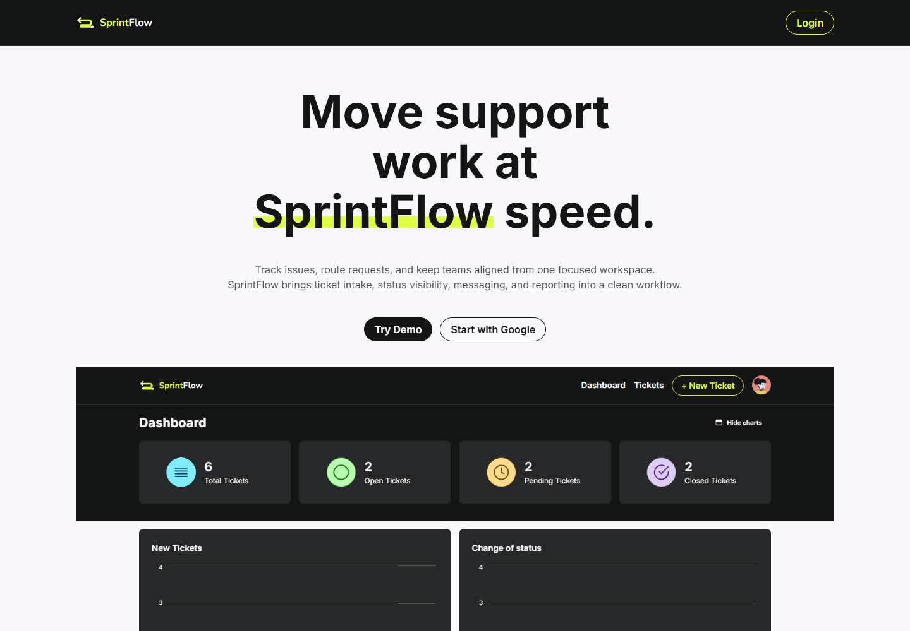
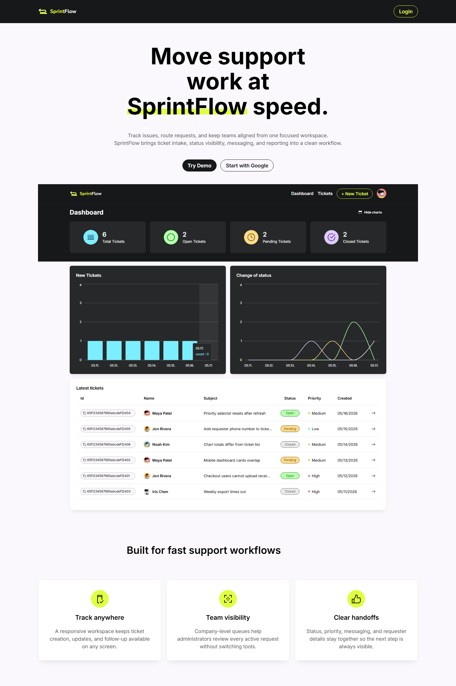
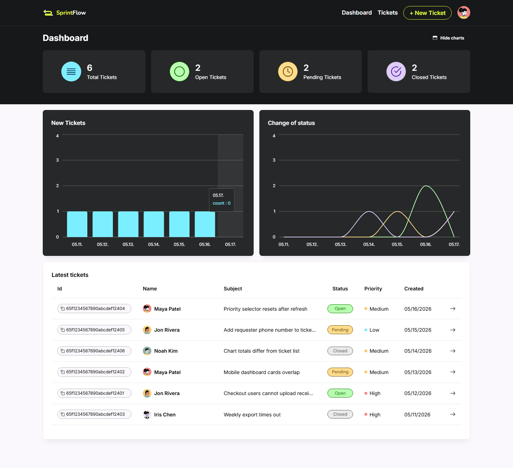
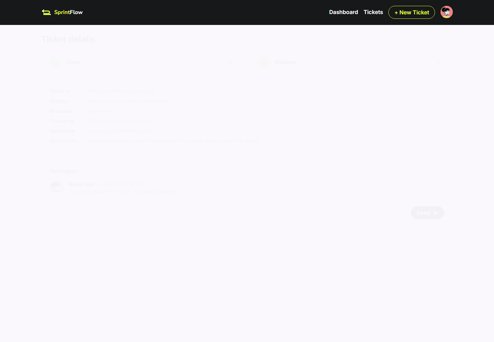
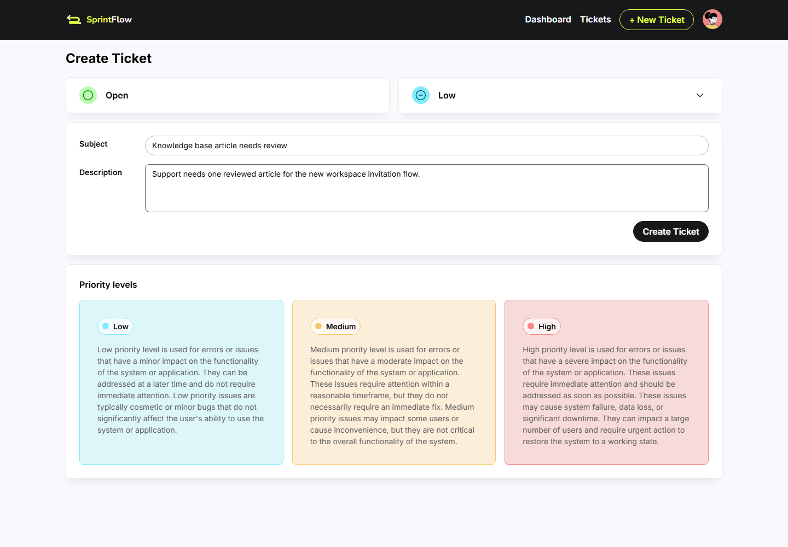

# SprintFlow

SprintFlow is a full-stack support workflow application for creating, triaging, and tracking issue tickets across a company. It combines Google OAuth sign-in, company onboarding, ticket messaging, priority/status controls, and dashboard analytics in a responsive React interface.

## Preview



| Landing | Dashboard |
| --- | --- |
|  |  |

| Ticket detail | Create ticket |
| --- | --- |
|  |  |

## Features

- Google OAuth login with JWT-based API sessions.
- Demo mode for screenshots and guided local previews without OAuth setup.
- Company onboarding with admin ownership for newly created companies.
- Ticket creation with subject, description, priority, and status metadata.
- Ticket detail views with requester information, message history, and status updates.
- Dashboard summaries for total, open, pending, and closed tickets.
- Bar and line charts for recent ticket volume and status movement.
- Swagger/OpenAPI documentation served by the API.

## Tech Stack

- Client: React, TypeScript, Vite, React Router, RxJS, Axios, Recharts, Carbon Icons.
- Server: Node.js, Express, TypeScript, MongoDB, Mongoose, Zod, JSON Web Tokens, Swagger UI.
- Testing and automation: Jest, Supertest, mongodb-memory-server, Playwright.
- Deployment: Dockerfiles for the client and server, plus GitHub Actions workflow templates for image publishing.

## Project Structure

```text
client/          React/Vite frontend
server/          Express API, MongoDB models, route tests, and OpenAPI spec
.github/         Docker image build workflows
```

## Local Setup

Install dependencies separately for the client and server:

```bash
cd client
npm install

cd ../server
npm install
```

Create environment files from the included examples:

```bash
cp client/.env.example client/.env
cp server/.env.example server/.env
```

Update the values for MongoDB, Google OAuth, and JWT signing before running the app.

Start the API:

```bash
cd server
npm run build
npm start
```

Start the client in a second terminal:

```bash
cd client
npm run dev
```

The default local URLs are:

- Client: `http://localhost:5173`
- API: `http://localhost:8000/api`
- API docs: `http://localhost:8000/api-docs`

## Environment Variables

Client:

```env
VITE_REDIRECT_URI=http://localhost:5173/callback
VITE_SERVER_URL=http://localhost:8000
VITE_CLIENT_ID=<GOOGLE_OAUTH_CLIENT_ID>
VITE_DEMO_MODE=false
```

Server:

```env
PORT=8000
MONGO_URI=<MONGODB_CONNECTION_STRING>
GOOGLE_CLIENT_ID=<GOOGLE_OAUTH_CLIENT_ID>
GOOGLE_CLIENT_SECRET=<GOOGLE_OAUTH_CLIENT_SECRET>
GOOGLE_REDIRECT_URI=http://localhost:5173/callback
JWT_SECRET_KEY=<JWT_SIGNING_SECRET>
TOKEN_EXPIRATION_TIME=2h
DEMO_MODE=false
```

## Scripts

Client:

```bash
npm run dev       # Start Vite development server
npm run build     # Type-check and build production assets
npm run preview   # Preview the production build
npm run docs:media # Generate README screenshots and GIF
```

Server:

```bash
npm run build     # Compile TypeScript
npm test          # Compile and run API tests
npm start         # Start compiled API from dist/
npm run demo:server # Start seeded in-memory demo API for docs media
npm run seed:demo    # Seed demo data into the configured MongoDB database
```

## Documentation Media

The checked-in screenshots and GIF are generated from the real client and API through Playwright. To regenerate them:

```bash
cd client
npm run docs:media
```

The generated files are written to `docs/assets/`. The Playwright workflow starts a temporary in-memory MongoDB-backed API with deterministic SprintFlow demo data, then captures the browser UI.

## API Documentation

After the server is running, open `http://localhost:8000/api-docs` for the Swagger UI. The source OpenAPI definition is stored at `server/swagger.yml`.
